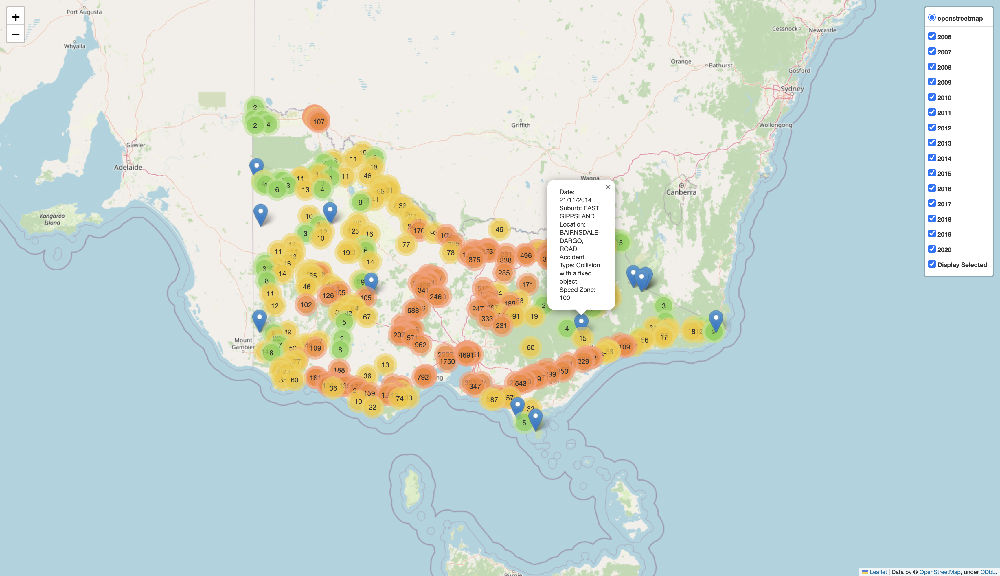

# Location Analysis

An Interactive Map was created to enable anyone to investigate the historical data of all crashes in Victoria from 2006 to 2020.

The map displays accidents with the specific details of the accident being displayed with a popup feature once hovered over with the mouse. The colouring of the locations change with the density of accidents recorded in the specific area. Higher density areas appear as orange, whereas lower density areas appear as green until the specific geographical location of the accident is observed.

For further analysis, each specific year can be toggled on and off to determine trends quickly. 

## Dependancies
pandas \
geopandas \
folium

## Data

Victorian Government Crash Statistics - 490949 Crash Incidences from 2006 to 2020 \
[Crash Statistics](https://discover.data.vic.gov.au/dataset/crash-stats-data-extract)
